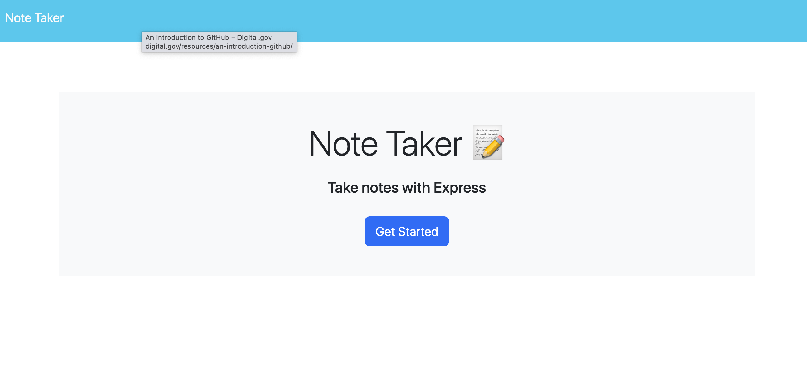
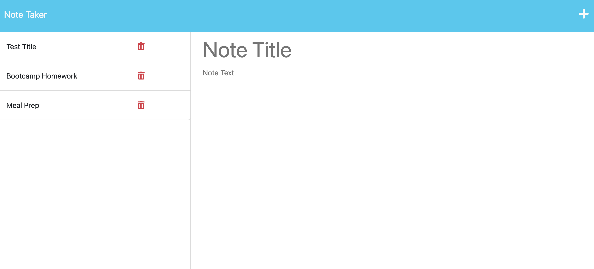

# note-taker

## Description

This application was created with express.js and was deployed with Heroku. The user can write, save, and delete notes. 

## Installation

N/A

## Usage

This note taker application allows a user to review posted notes, write and save new notes, and delete notes as needed. 

[Note-Taker](https://note-taker-ap.herokuapp.com/)

## Credits

N/A

## License

N/A